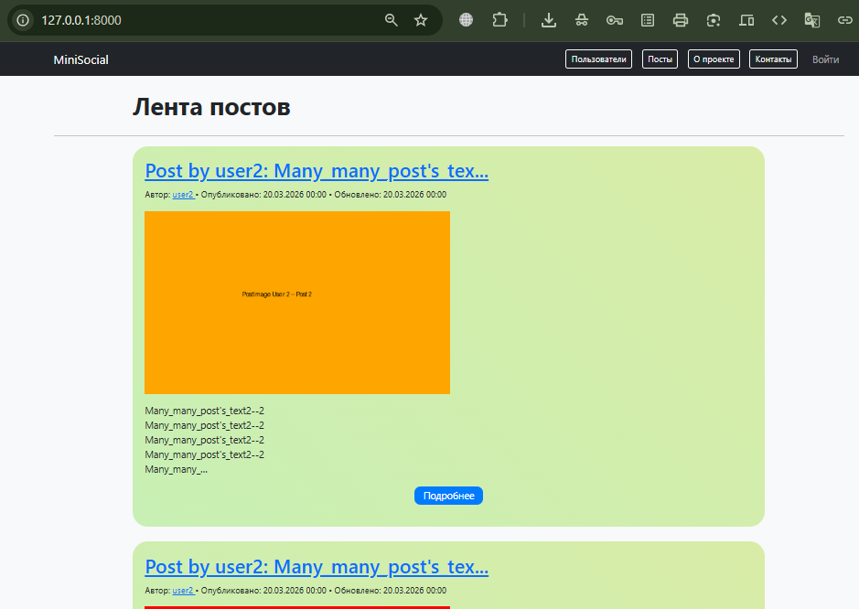
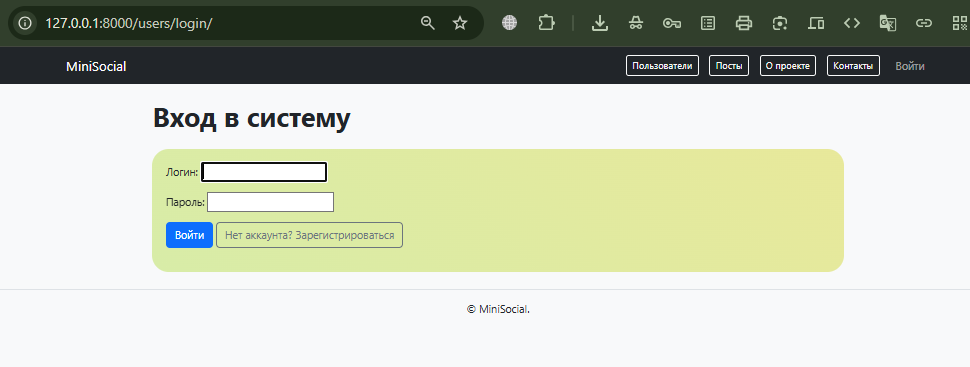
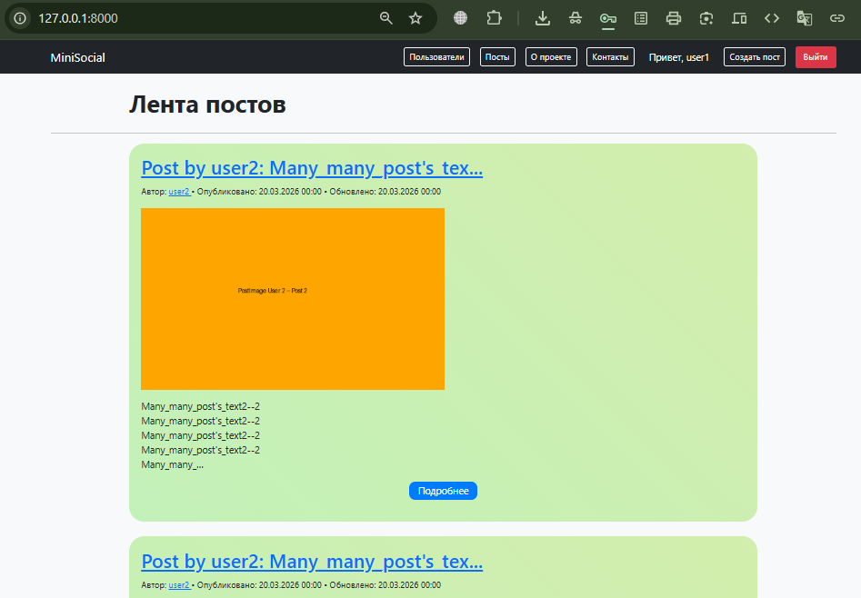
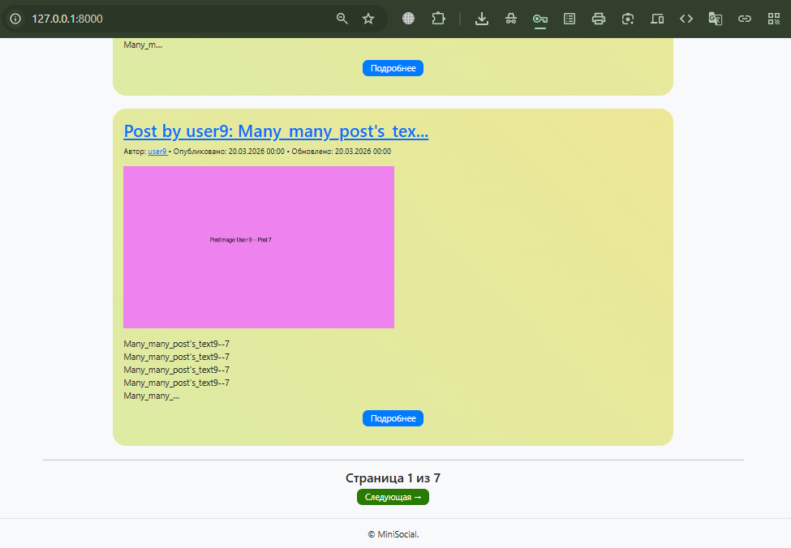
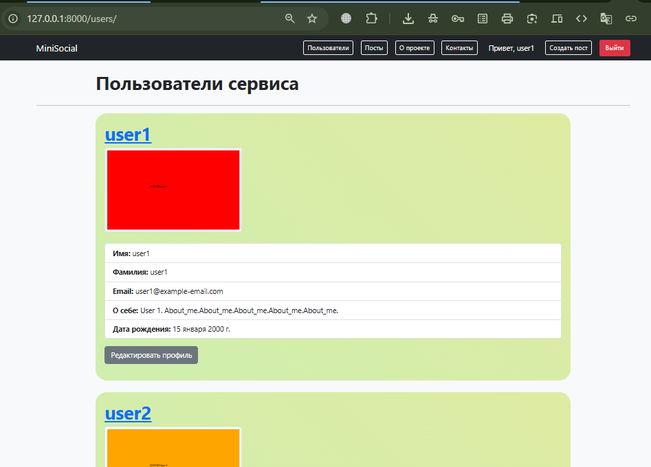
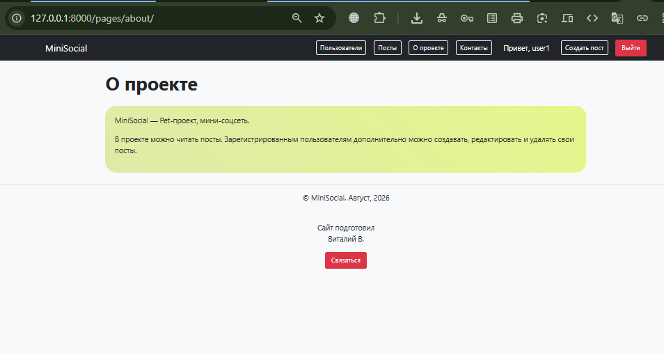
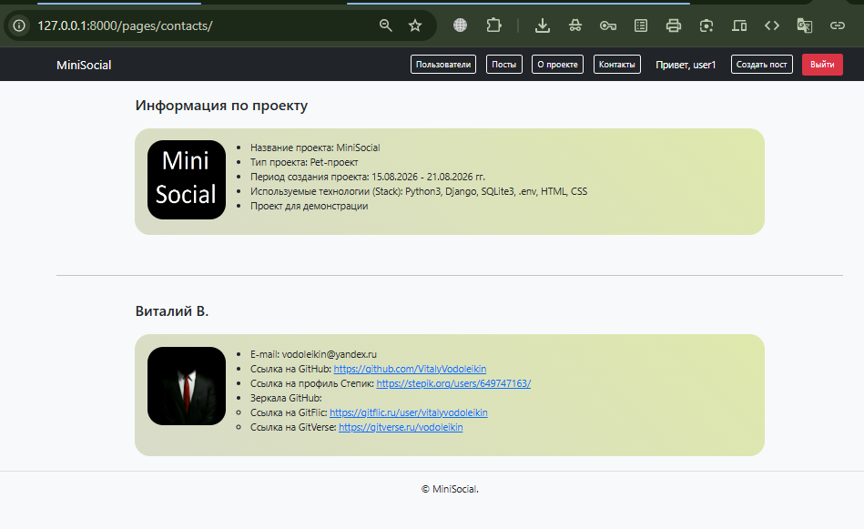
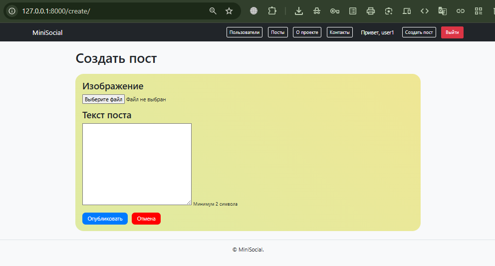

# Social_mini_project

Мини‑проект социальной сети на Django: поддерживает профили пользователей, посты, аутентификацию и базовую функциональность.

##### ----------

## Функционал
Реализовано:
- Регистрация, вход и выход пользователей.
- Профили пользователей: просмотр профилей других пользователей, редактирование собственного профиля (имя, фамилия, аватар, биография, дата рождения).
- Список пользователей с пагинацией.
- Валидация данных:
    - уникальность email и username при регистрации;
    - проверка размера аватара (не более 10 МБ).
- Авторизация и защита маршрутов: редактирование профиля доступно только авторизованным пользователям и только для своего профиля.

#### ---

## Стек технологий
- Python
- Django
- HTML
- CSS
- Git

<br>
<div style="display: flex; justify-content: space-between; align-items: center; width: 100%;">
      
      
  
  
</div>
<br>

#### ---

## Установка и запуск

### 1. Клонирование репозитория и переход в папку с проектом
Выполните последовательно команнды в терминале
```
git clone <URL-репозитория>
cd social_mini_project
```

### 2. Создание виртуального окружения и установка зависимостей
Создайте и активируйте виртуальное окружение командами в терминале
```
python -m venv venv

venv\Scripts\activate  # для Windows
source venv/bin/activate  # для macOS/Linux

pip install -r requirements.txt  # Установка зависимостей
```

### 3. Настройка проекта
На основе файла ".emv.example" создайте свой файл с переменными окружения ".env".
Убедитесь, что `DEBUG = True` для локальной разработки.

### 4. Применение миграций и создание суперпользователя
Примените миграции и создайте суперпользователя коммандами в терминале:
```
python manage.py migrate
python manage.py createsuperuser
```

### 5. Для наполения сайта тестовыми данными используйте автоматическую загрузку фикстур
В папке "users_data/" имеется файл со скриптом для генерации тестовых данных пользователей и их постов.
Перейдите в эту папку и запустите скрипт - он сгенерирует все данные в виде фикстур:
```
cd user_data/
python get_many_data.py
```
После этого будут сгененрированы 2 файла с фикстурами и один текстовый файл с данными пользователей.
Также будут сгенерированы простые файлы с изображениями для аватаров пользователей и для каждого их поста.
Изображения сгенерируются в папку "media/".
Файлы с фикстурами нужно будет загружать по порядку:
- сперва первый файл (начинается с цифры 1), 
- затем второй файл (начинается с цифры 2)... -
только в таком порядке, иначе фикстуры не подгрузятся.
Далее - выйдите из этой папки в директорию "social_mini_project/", где лежит управляюий файл "manage.py".
Непосредственно подгрузите фикстуры в базу данных командами:
```
cd ..
# Подгружаем тестовых пользователей
python manage.py loaddata users_data/1_dump_many_simple_users.json
# Подгружает тестовые посты этих пользователей
python manage.py loaddata users_data/2_dump_many_posts.json
```

### 6. Запуск сервера
Запустите сервер и пользуйтесь имеющимся функционалом мини-соцсети:
```
python manage.py runserver
```
Проект будет доступен по адресу http://127.0.0.1:8000/.

### 7. Основные маршруты
Я не стал описывать их, так как в техническом задании не было задачи явно прописать эндпоинты (например, для API-функционала).
В задании было четкое ограничение - использование только функционала Django.
Для пользователя-человека все будет интуитивно понятно.

- Стартовая страница

- Вход в систему

- Лента постов

- Пагинация постов внизу страницы

- Вкладка "Пользователи"

- Вкладка "О проекте"

- Вкладка"Контакты"

- Вкладка создания поста

- и так далее - все интуитивно понятно
- Наслаждайтесь! Я старался для вас!

### 8. Контактная информация

Выполнил Pet-проект 
Водолейкин Виталий Юрьевич, python-backend developer.
Август 2026 г.
Контакты для сотрудниества:
* Email: vodoleikin@yandex.ru
* TG: @vodoleikin_v
Мои профили
* Профиль в GitHub: [Профиль в GitHub](https://github.com/VitalyVodoleikin)
* Зеркало в GitFlic: [Зеркало в GitFlic](https://gitflic.ru/user/vitalyvodoleikin)
* Зеркало в GitVerse: [Зеркало в GitVesre](https://gitverse.ru/vodoleikin)
* Профиль на Stepik.org: [Профиль на Stepik.org](https://stepik.org/users/649747163/)

### 9. Лицензия.

Проект для свободного использования с обязательным указанием автора проекта.
